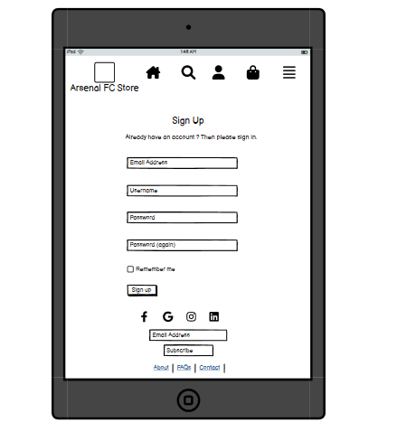
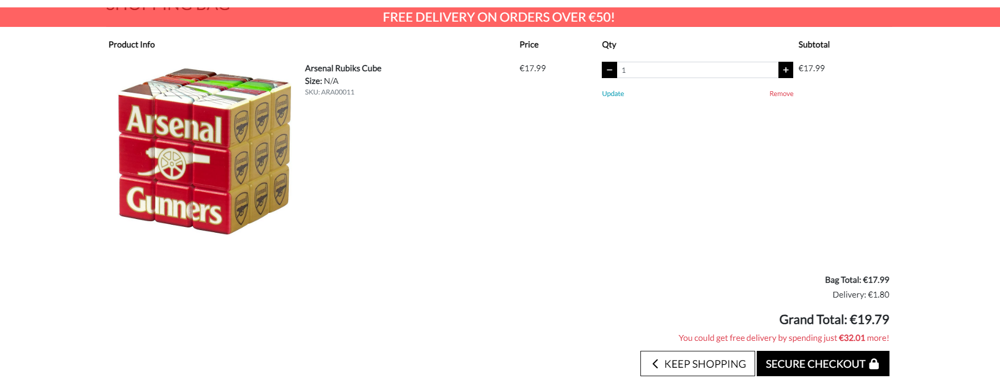

# __Arsenal FC store - Portfolio Project 5__

Arsenal Fc store is an online store were users can find Arsenal jerseys and accessories.

Users can register an account and buy products, usres can also contact the Araenal Fc store by filling out a contact form.

The aim of this project is to allow users to be able easily shop on the arsenal fc store.

[Live link to website](https://arsenal-fc-store-9dd3251c1b46.herokuapp.com/)

## UX

Some of the colours I used when developing this site, I kept the colours simple so it wouldnt distract the users from the site.

- `rgba(255, 0, 0, 0.767)` was used as the delivery banner and the welcome message displayed on the home page. I chose this colour as I thouhgt it represents the Arsenal FC team colour.
- `#fff` was used for the sign up.
- `#28a745` was used for some of the arrows seen on this site (bootstrap)
- `#6c757d` was used for some of the arrows seen on this site (bootstrap)
- `#dc3545` was used for some of the arrows seen on this site (bootstrap)
- `#ffc107`  was used for some of the arrows seen on this site (bootstrap)
- `#17a2b8` was used for some of the arrows seen on this site (bootstrap)
- `#f8f9fa` was used for some of the arrows seen on this site (bootstrap)
- `#343a40` was used for some of the arrows seen on this site (bootstrap)
- `#222` was used for the allauth form inner content
- `#dc3545` was used for the custom checkout box
- `#17a2b8` was used for the allauth form inner content (text-info)

## Typography

- [Lato](https://fonts.google.com/) was used for the site text.
- [Font Awesome](https://fontawesome.com/) was used for the icons seen throughout the site.

## User Stories

### Registered users

- As a first time site visitor I want to clearly be able to see the site's purpose to see if I would want to continue browsing the site. `(MUST HAVE)`
- As a user I want to clearly be able to navigate the website so I can find what I am looking for. `(MUST HAVE)`
- As a site user I want to be able to search certain products that I am looking for and to see if they are available on the website. `(SHOULD HAVE)`
- As a site user I want to be able to view all products by clicking the 'All Products ' link. `(MUST HAVE)`
- As a site user I want to be able to click on a certain product and to be brought to it's own individual page and to read the description about the product. `(MUST HAVE)`
- As a site user I want to be able to sort products by category (Home/Away/Accessories) so I can find the right category of what I am looking for. `(SHOULD HAVE)`
- As a site user I want to be able to add products to my shopping basket so that I can procced to the checkout and purchase them. `(MUST HAVE)`
- As a site user I want to be able to see the running total amount in my basket as I am shopping so I know how much I am spending. `(MUST HAVE)`
- As a site user I want to be able to checkout with a card payment so that I can purchase the products I want to buy. `(MUST HAVE)`
- As a site user I want to be able to receive an order confirmation email after I purchase from the shop so that I have a record of what I have purchased from the shop. `(SHOULD HAVE )`
- As a site user I want to be able to create an account so that I can save my billing and shipping details and to keep track of all the purchases I've made. `(MUST HAVE)`
- As a registered user I want to be able to edit my account details so that I can keep my account up to date and make changes if I need to. `(SHOULD HAVE)`
- As a site user I want to be able to add and remove items in my bag. `(MUST HAVE)`
- As a site user I want to be able to sign up to the sites mailing list so that I can stay up to date with the latest offers and promotions. `(SHOULD HAVE)`
- As a site user I want to be able to read the privacy policy so that I can a so I can understand the stores policy. `(SHOULD HAVE)`
- As a site user I want to be able to fill out a contact form so that I can enquire about a certain product or ask about my order. `(SHOULD HAVE)`
- As a site user I want to be able to see the prices of the products so I know weather or not I want to purchase the product. `(MUST HAVE)`

### Site admin

- As a site admin I want to be able to create new products from the front end so that I can easily add new products to the site. `(SHOULD HAVE)`
- As a site admin I want to be able to edit existing products so that I can ensure that all products are up to date and has the correct information. `(SHOULD HAVE)`
- As a site admin I want to be able to delete certain products that I know longer want on the site. `(SHOULD HAVE)`
- As a site admin I want to be able to set appropriate keywords on the site pages so that I can increase the chance of customers finding the site when searching for certain products. `(MUST HAVE)`
- As a site admin I want to be able to view open tickets and also mark as seen and close tickets. `(SHOULD HAVE)`

### Future features

- As a site user I want to be able to apply a discount code to receive a discount on a product. `(WONT HAVE)`
- As a site user I want to be able to read an faq page. `(WONT HAVE)`
- As a site admin I want to be bale to set the stock number on products so that I can let users know if a product is out of stock. `(WONT HAVE)`

## Wireframes

I used [balsamiq](https://balsamiq.com/wireframes) to design my site wireframes.

### Home page wireframes

Click to view the home page wireframes

#### Desktop

### Basket page wireframe

Click to view the basket page wireframes

#### Desktop

### Basket page wireframe

Click to view the checkout wireframes

#### Desktop

### Checkout page wireframe

Click to view the checkout wireframes

#### Tablet

### Contact page wireframe

Click to view the contact page wireframes

#### Mobile

### Privacy page wireframe

Click to view the privacy page wireframes

#### Mobile

### Product info page wireframe

Click to view the product info page wireframes

#### Mobile

### Sign up page wireframe

Click to view the sign up page wireframes

#### Tablet

### Sign up page wireframe

Click to view the sign in page wireframes

#### Desktop

## Features

### Existing features

- **Home page**

    - When a user first opens the webpage they are welcome with a message on the screen on the background of the Arsenal FC stadium, there is also a 'Shop now' button that will bring the user to the products page. They will aslo be able to see the navigation bar at the top of the page.

    

- **Home kit page**

    - Once the user clicks on the 'Home Kit' navigation they will be brought to a page that will display only the Home kits.

    

- **Away kit page**

    - Once the user clicks on the 'Away Kit' navigation they will be brought to a page that will display only the Away kits.

    

- **Retro kit page**

    - Once the user clicks on the 'Retro Kit' navigation they will be brought to a page that will display only the Retro kits.

    

- **Accessories page**

    - Once the user clicks on the 'Accessories' navigation they will be brought to a page that will display only the Accesories.

    

- **Sign up page**

    - A user can register an account with is accessible when the click on 'My account' in the navigation bar. Users will be asked to enter their email address, username and password. Users will get a confirmation email once they have registered an account.

    

- **Sign in page**

    - The sign up pages will ask the user to enter their name or email address and their password, if a user forgets their password they can click the 'forgot password' button and a email will be sent to them to reset their password. There is also a 'remember me' button.

    

- **Sign out page**

    - When a user presses the sign out button they will be asked if they are sure they want to sign out.

    

- **Product sorting**

    - There is a 'sory by' drop down which will allow user to sort products by price, category, rating and name.

     

- **Product detail**

    - When a user clicks on a product they will be brought to a page which will show the price of the product, the product rating and also a description of the product. It also includes a size selector dropdown, an add to bag option and a 'keep shopping button'.

    

- **Add to bag**

    - When a user adds a product to the bag a success message will appear to notify the user the product was added to their bag and will tell the user how much more theu need to spend to receive free delivery.

    

- **View bag**

    - The view bag page will allow customer to add more of a quantity of a ceratin product or to remove a product. The grand total will appear at the bottom of the page.

    

- **Checkout page**

    - The checkout page will show the user what they are ordering and the user will also be asked to fill in their name, email and home address, a save information button is at the bottom of the page for faster checkout if the user wants to return to the store.

     

- **Checkout confirmation page**

    - A checkout confirmation page will be shown once the user has entered their correct card details showing what they have order. A confirmation email will be sent to the user too.

    

- **Profile page**

    - The profile page allows users to update their information if needed and the user can also see their order history.

    

- **Admin add product**

    - When the admin is logged in a product management naviagtion will show allowing the admin to add new products to the store.

    
    
    

- **Edit and delete product**

    - When the admin is logged in they can an edit and delete button will show on any product, the admin can edit a certain product and also delete a product from the store.

    
    
    

- **Back to top button**

    - A back to top button is displayed on the products page which will bring the user to the top of the page when clicked.

    

- **Footer**

    - Social media icons are at the bottom of each page which will bring user to the selected page.

    

- **Privacy page** 

    - A privacy button is at the bottom of each page in the footer which will bring the user to the privacy policy page.

    
    

- **Contact page** 

    - A contact button is at the bottom of each page in the footer which will bring the user to a conatct page with a detailed map and a contact form that the user can fill out.

    
    

- **Product review** 

    - A user can leave a review on a product which will have to be approved by the admin.

    

- **Search bar** 

    - A search bar is in the navigation bar which allows users to search for a product.

    

- **Nav bar (smaller screen)**

    - When the user is view the site on small screen the nav bar becomes a dropdown.

    
    

### Future features

These are some of features which can be implemented in the future. These features have be logged as wont have in my MoSCoW prioritization.

- Discount code
    - I would like to add a feature which allow users to enter a discount code to get a discount on a product they want.
- Stock management
    - I would like add a stock management feature which will show user if a certain product is low on stock or out of stock.
- FAQ
    - I would like to add a feature which allows users to views Faqs.

## Emails and toasts

## Model Schema

Two relationsal databases were used to create this site. The builtin django SQLite databse was used for developemnt and Elephant SQL Posrgres for the deployed version.

I found https://dbschema.com/download.html did a great job for documenting my database ERD etc.

### User model

- User - the Django Allauth user model containing information such as username and password.
- Profile - stores a users default delivery information and is connected to the user via a one to one relationship.

### Order model

- Order - a foreign key relationship connects the user to the storage of the complete order data.
- OrderLineItem - stores the products information for a singlw product purchased on an order. Foreign key relationships connects the product and order.

## Tools and technologies used

- [HTML](https://en.wikipedia.org/wiki/HTML) was used for the main site content.
- [CSS](https://en.wikipedia.org/wiki/CSS) was used for the design and layout.
- [bootstrap](https://getbootstrap.com/) was used for the front-end CSS framework responsiveness and pre-built components.
- [JavaScript](https://en.wikipedia.org/wiki/JavaScript) was used for the user interaction on the site for automatically closing Django messages.
- [Python](https://en.wikipedia.org/wiki/Python_(programming_language)) was used as the back-end programming language.
- [GitHub](https://github.com/) was used for secure online code storage.
- [Gitpo](https://www.gitpod.io/) was used as a cloud-based IDE for development.
- [Django](https://www.djangoproject.com/) was used as the python framwork for the site.
- [PostgreSQL](https://www.postgresql.org/) was used as the relational database management.
- [ElphantSQL](https://www.elephantsql.com/) was used as the postgres database.
- [Heroku](https://www.heroku.com/) was used as hosting the deployed back-end site.
- [AmazonAWS](https://aws.amazon.com/) was used for online static storage.
- [stripe](https://stripe.com/ie) was used for the payments.
- [Balsamiq](https://balsamiq.com/wireframes/) was used for to design my site wireframe.
- [Google fonts](https://fonts.google.com/) was used for my fonts throughout my site.
- [Font awesome](https://fontawesome.com/) was used for my icons I used throughout my site.
- [MailChimp](https://mailchimp.com/) was used for the subscribe secton in the footer.

## Agile developemnt 

[GitHub Projects](https://github.com/AdamRalph123/Arsenal-FC-store/projects?query=is%3Aopen) served as an agile tool for this project. User stories were used to map out the development progress of this project, It helped me to understand what was nedded to be done and what was done.

### GitHub issues

 has a label of **Wont have** as these issues will be implemented in the future.

 has labaels of **Must have** and **Should have** which is what the site must contain and what the site should contain.

 ### MoSCow prioritization

- **Must have**: The 'MUST' level requirements are those requirements which will definitely be included to be delivered.
- **Should have**: The 'SHOULD' level requirements are those requirements which should be included if at all possible. If the project has capacity and time and it will not jeopardise any of the 'must have' requirements.
- **Could have**: The 'COULD' level requirements are the requirements which could be included if it doesnt have any impact on any of the 'should' or 'must' requirements.
- **Wont have**: The 'WONT' level requirements tend to be the requirements which will not be  included or implemented this time but are requirements that would be favoured for a future delivery or implementation.

## Facebook page

I made a facebook page for my online store and included some screenshots of activity.

## Database used 

[ElephantSQL](https://www.elephantsql.com/) was used for deployemnt to heroku.

[Stripe](https://stripe.com/ie) was used for the payments.

## Testing

For all testing, please refer to the [TESTING.md](TESTING.md) file.

## Bugs

There was not any major bugs while working on this site, some were just simple spelling mistakes, which would cause a certain page to not open.

I did have issues with the deployment and connecting the database as I kept getting errors which is why there is a lot commits messages.

## Deployment 

The live deployed application can be found on [Heroku](https://git.heroku.com/car-talk-blog.git).

### ElpephantSQL 

This project uses [ElephantSQL](https://www.elephantsql.com/) for postgreSQL database.

To obtain your own Postgres database, sign-up with your GitHub account, then follow these steps:
- Click **Create new instance** to start a new database.
- Provide a name, this is commonly the name of your project.
- Select the **Ting turtle plan** as this is free.
- You can leave the **tags** blank.
- Select the **Region** and **Data center** closest to you.
- Once created, you can click on the nee database name where you can view the database URL and password.

### Heroku Deployment

This project uses [Heroku](https://www.heroku.com/), a platform as a service that enables developers to build, run and operate applications entirely in the cloud.

- Select **new** in the top-right hand corner in your heroku dashboard and select **create new app** from the dropdown menu.
- Your app name must be unique, then choose the region closest to you, then slect **create app**.
- From the new app settings, click **reveal config vars** ans set your enviroment variables.

| Key | Value |
| --- | --- |
| `AWS_ACCESS_KEY_ID` | Insert your own API key here. |
| `DATABASE_URL` | insert your own ElephantSQL database url here. |
| `DISABLE_COLLECTSTATIC` | 1 (*this is temporary and can be removed on your final deployment*) |
| `SECRET_KEY` | This can be any random secret key. |
| `AWS_SECRET_ACCESS_KEY` | Insert your own API key here. | |
| `EMAIL_HOST_PASS` | Insert your own API key here. | |
| `EMAIL_HOST_USER` | Insert your own email here. | |
| `STRIPE_PUBLIC_KEY` | Insert your own API key here. | | | |
| `STRIPE_SECRET_KEY` | Insert your own API key here. | | | |
| `STRIPE_WH_SECRET` | Insert your own API key here. | | | |
| `USE_AWS` | Set to true. | | | |

Heroku needs two additional files in order to deploy properly.
- requirements.txt file.
- Procfile.

You can install this projects ** requirements** using:
- `pip3 install -r requirements.txt`

If you have your own package that have been installed , then the requirements file needs updating using:
- `pip3 freeze --local > requirements.txt`

The **profile** can be created with the following command:
- `echo web: gunicorn app_name.wsgi > Profile`
- Make sure to replace 'app_name' with the name of your **own** app name.

For Heroku deployment, follow these steps to deploy your site:

- **Automatic** select 'enable automatic deployment'.
- **Manual deployment** can be done by:
    - By typing `heroku login -i` in the terminal.
    - Set the remote for heroku: `heroku git:remote -a app_name` replace 'app_name' with your own app name.

### Cloning 

You can clone this repository by follwoing these steps:

- Go to the [GitHub repository](https://github.com/AdamRalph123/Car-talk-blog).
- Locate the code button above the list of files and click it.
- Select if you prefer to clone using HTTPS, SSH or GitHub CLI and click copy button to copy the URL to your clipboard.
- Open Git bash or Terminal.
- Chanhe the current working directory to the one you the clonned directory.
- In your IDE terminal, type the following command to clone the repository: `git clone https://github.com/AdamRalph123/Car-talk-blog`.
- Press enter to create your clone.

### Forking

By forking this GitHub repository, you make a copy of the original repository on your GitHub account to view or makw chnages to it without affecting the ownders repository.

Follow these steps to fork this repository:

- Login into GitHub and locate [GitHub repository](https://github.com/AdamRalph123/Car-talk-blog).
- At the top of the repository Just above the **settings** button on the menu, locate the **fork** button.
- Once clicked, you should now have a copy of the original repository in your own GitHub account.

## Credits

I would like to credit [Code Institute](https://codeinstitute.net/) for allowing us to use the *Boutique ado* practice project as a base to our own e commerce store.

### Content

| Source | Location | Notes |
| --- | --- | --- |
| [Privacy Policy Generator](https://www.privacypolicygenerator.info/) | Privacy | to create the privacy policy page. |
| [Football Kit Archive](https://www.footballkitarchive.com/) | base.html, index.html, post detail.html and uploading posts | was used for downloading images that was used to upload to my store. |
| [Bootstrap](https://getbootstrap.com/) | All html pages, contact form | was used for the front-end CSS framework responsiveness and pre-built components, contatc form too. |
| [Footer](https://mdbootstrap.com/docs/standard/extended/social-media-icons-footer/) | base.html | was used for creating my footer. |
| [Arsenal official website](https://arsenaldirect.arsenal.com/) | For all my accessories images. |
| [Google mapp](https://www.google.com/maps) | footer.html | for the map on my footer page. |
| [Mailchimp](https://mailchimp.com/) | footer.html | for the subscribe section. |
| [Sitemap.xml](https://www.xml-sitemaps.com/) | sitemap.xml | used to create sitemap |

 ##  Acknowledgement
 I would like to thank:
 
 - My mentor Jubril Akolade who is always there for support and to answer any questions i have for him.
 - I would like to thank [Code Institute](https://codeinstitute.net/) student support for always helping me to solove my errors.
 - The [Slack](https://slack.com/intl/en-ie/https://slack.com/intl/en-ie/) community which i can always rely on.
 - I would like to thank the assessment team for taking their time to assess my project.

