# Testing

Return back to the [README.md](README.md) file.

## Code validation

### HTML

I have used the recommened [HTML w3c validator](https://validator.w3.org/) to test and validate all of my html files.

Most of my HTML files has similar issues with errors and warnings which I was not able to fix as it caused even more errors in my code.

As my project uses Jinja syntax such as, `` and `` if will not validate properly if I copy and paste my code straight from my workspace.

In order to properl validate my HTML pages with Jinja syntax for authenticated pages, I followed these steps.

- Navigate to the deployed page which requires authentication.
- Right click anywhere on the page and select **View page source** or `CTRL+U`.
- This will display the compiled code without any Jinja syntax.
- Copy all the code (CTRL+A) and use the [Validate by input](https://validator.w3.org/#validate_by_input)

| Pages | Screenshots | Notes |
| --- | --- | --- |
| Home |  | 2 errors |

### CSS
 
 I have used the recommneded [CSS Jigsaw validator](https://jigsaw.w3.org/css-validator/) to validate my css file.

| File | Screenshot | Notes |
| --- | --- | --- |
| base.css |  | Pass: no errors |
| profile.css | 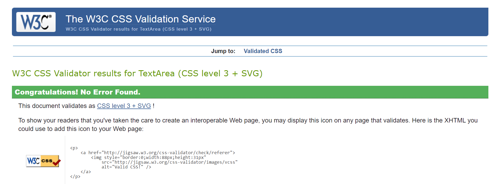 | Pass: no errors |

### JavaScript

I have used [JShint validator](https://jshint.com/) to validate my javascript code that is found in my base.html file. My javascript code has similar issues testing.

| File | Screenshot | Notes |
| --- | --- | --- |
| country field | 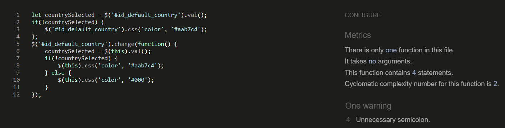 | Pass: no errors |

### Python

I have used [CI Python linter](https://pep8ci.herokuapp.com/) to validate all of my python files.

All of my Python passed and has no issues

| File | Screenshot | Notes |
| --- | --- | --- |
| Settings.py arsenal |  | Pass: no errors |
| views.py arsenal |  | Pass: no errors |
| bag urls.py |  | Pass: no errors |
| bag views.py |  | Pass: no errors |
| checkout admin.py |  | Pass: no errors |
| contact admin.py |  | Pass: no errors |
| contact models.py |  | Pass: no errors |
| signals.py |  | Pass: no errors |
| checkout models.py |  | Pass: no errors |
| context.py |  | Pass: no errors |
| checkout forms.py | 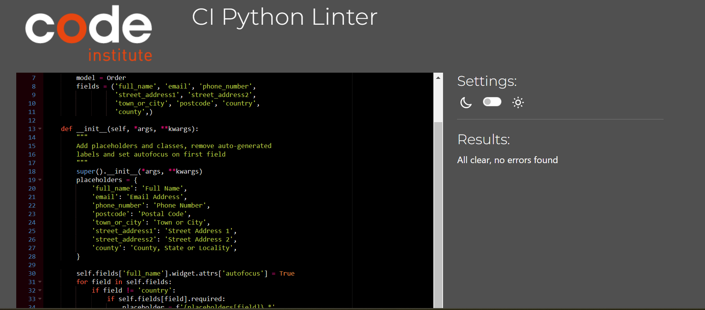 | Pass: no errors |
| webhooks handler |  | Pass: no errors |
| webhooks.py |  | Pass: no errors |

## Lighthouse audit

I have tested my deployed site using the lighthouse audit tool to check for any major issues.

| Page | Screenshot | Notes |
| --- | --- | --- |
| Home page |  | Some minor warnings |
| All products |  | Some minor warnings |
| checkout |  | Some minor warnings |
| contact page |  | Some minor warnings |
| Profile page |  | Some minor warnings |
| Open ticket |  | Some minor warnings |
| Home page |  | Some minor warnings |
| Product management |  | Some minor warnings |
| Shopping bag |  | Some minor warnings |
| Sign in |  | Some minor warnings |
| Sign out |  | Some minor warnings |

## Manual testing

Manual testing is used below to make sure the sites functionality is working and deos not crash.

| Page | User action | Expected result | Pass/fail |
| --- | --- | --- | --- |
| Home page | Click on logo | Redirected to home page | Pass |
| Sign up | Click on Register navigation | Brings user to sign up page. User is asked to enter username, email address and password. Click submit, user is directed to home page. | Pass |
| Sign in | Click on Sign in navigation | Redirected to sign in page. User must enter the correct Sign in details. When entered correctly users will be directed to the home page with a message appearing to let the user know they are signed in. | Pass |
| Sign out | Click on sign out navigation | User will be redirected to a sign out comfirmation page. When user signs out they will be brought to the home page with a message appearing to let the user know they are signed out. | Pass |
| Review | Type review and submit | users will be notified that their review has been added. | Pass |
| Add item to bag | Click on an product | user will be notified that a product has been added tp their bag | Pass |
| contact form | fill out form and submit | When the user fills out a contact form the user will receive an email to say that their query has been notified. | Pass |
| subscribe button | Click on subscribe button | when a user enters their emial address and clicks subscribe they will be notified that they have been subscribed | Pass |
| Add/remove item from bag | click add/ remove button | when the user clicks add/remove in the shopping bag that will be notified | Pass |

## User story testing 

I have tested each user story below including screenshots.

| User story | Screenshot |
| --- | --- |
| As a first time site visitor I want to clearly be able to see the site's purpose to see if I would want to continue browsing the site. |  |
| As a user I want to clearly be able to navigate the website so I can find what I am looking for. |  |
| As a site user I want to be able to search certain products that I am looking for and to see if they are available on the website. | 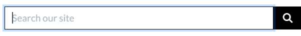 |
| As a site user I want to be able to view all products by clicking the 'All Products ' link. | 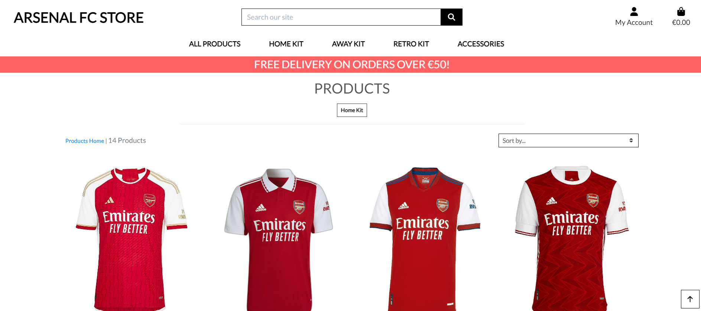 |
| As a site user I want to be able to click on a certain product and to be brought to it's own individual page and to read the description about the product. | 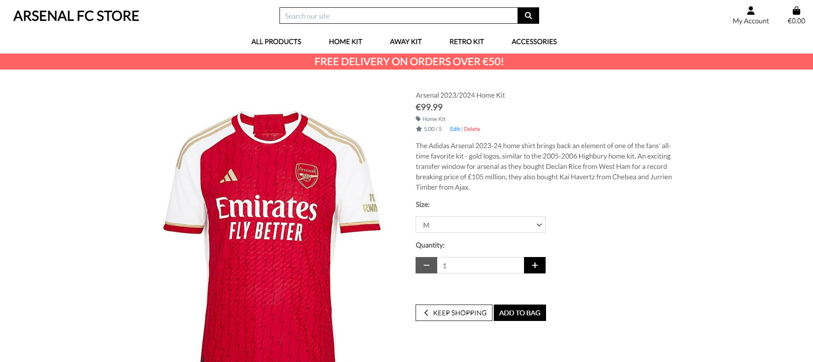 |
| As a site user I want to be able to sort products by category (Home/Away/Accessories) so I can find the right category of what I am looking for. | 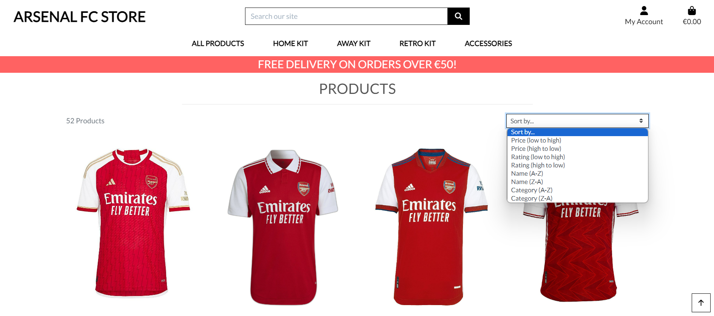 |
| As a site user I want to be able to add products to my shopping basket so that I can procced to the checkout and purchase them |  |
| As a site user I want to be able to see the running total amount in my basket as I am shopping so I know how much I am spending | 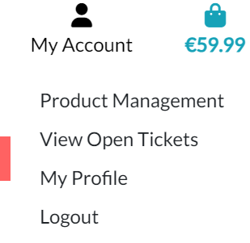 |
|As a site user I want to be able to checkout with a card payment so that I can purchase the products I want to buy. | 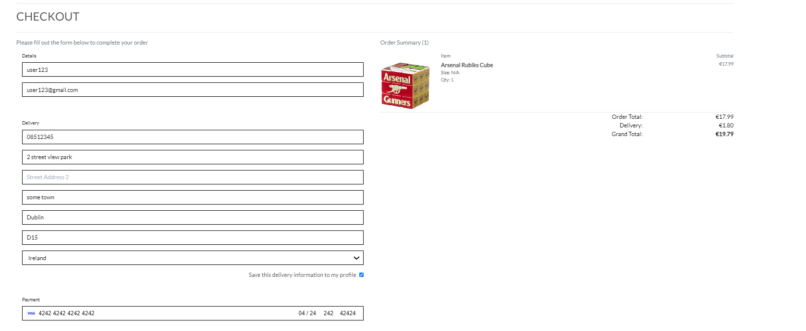 |
| |  |
| As a site user I want to be able to receive an order confirmation email after I purchase from the shop so that I have a record of what I have purchased from the shop |  |
|As a site user I want to be able to create an account so that I can save my billing and shipping details and to keep track of all the purchases I've made. |  |
|As a registered user I want to be able to edit my account details so that I can keep my account up to date and make changes if I need to. | 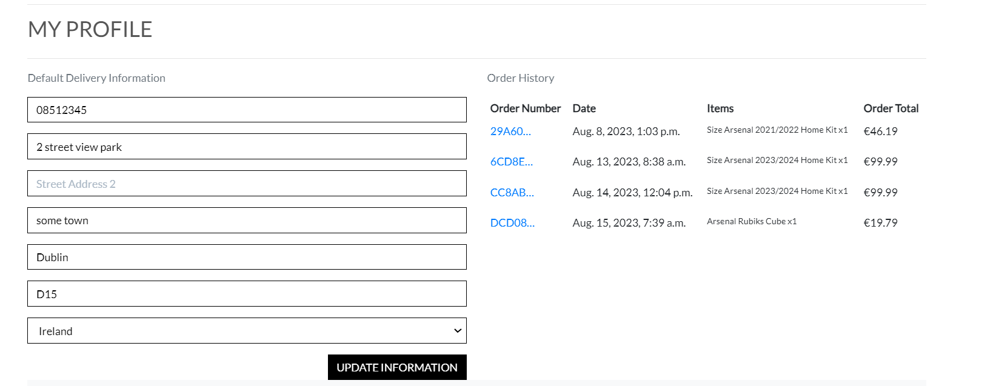 |
|As a site user I want to be able to add and remove items in my bag. |  |
|As a site admin I want to be able to create new products from the front end so that I can easily add new products to the site.. |  |
|As a site admin I want to be able to edit existing products so that I can ensure that all products are up to date and has the correct information. | 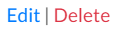 |
|As a site admin I want to be able to delete certain products that I know longer want on the site. |  |
|As a site user I want to be able to sign up to the sites mailing list so that I can stay up to date with the latest offers and promotions.|  |
|As a site user I want to be able to read the privacy policy so that I can a so I can understand the stores policy. | 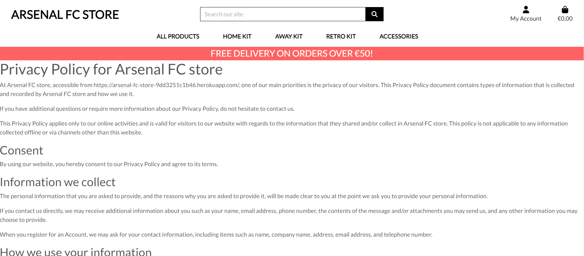 |
|As a site user I want to be able to fill out a contact form so that I can enquire about a certain product or ask about my order. |  |
|As a site user I want to be able to see the prices of the products so I know weather or not I want to purchase the product. |  |
|As a site admin I want to be able to view open tickets and also mark as seen and close tickets |  |

 The following are user stories that I was not able to implement and are labeled as wont have.

| User story | Screenshot |
| --- | --- |
| As a site user I want to be able to apply a discount code to receive a discount on a product. | N/A |
| As a site user I want to be able to read an faq page | N/A |
|As a site admin I want to be bale to set the stock number on products so that I can let users know if a product is out of stock | N/A |
